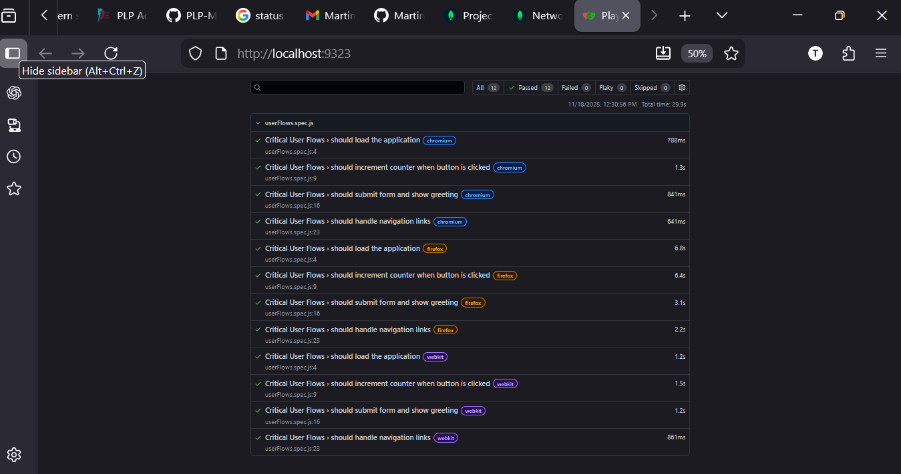

# Testing and Debugging - MERN App Reliability

## 📋 Assignment Overview
This project implements comprehensive testing strategies for a MERN stack application, including unit testing, integration testing, and end-to-end testing with debugging techniques.

## 🧪 Testing Implementation

### Test Types Completed:
- ✅ **Unit Testing** - 25 tests (Server & Client)
- ✅ **Integration Testing** - API endpoints 
- ✅ **End-to-End Testing** - Cross-browser user flows
- ✅ **Debugging Techniques** - Error boundaries & logging

## 📊 End-to-End Test Results



*Playwright E2E tests showing 12/12 tests passed across multiple browsers*

## 🚀 Quick Start
```bash
# Run all tests
npm test

# Run specific test types
npm run test:unit
npm run test:integration  
npm run test:e2e
```

## 📁 Project Structure
```
├── server/          # Backend with unit & integration tests
├── client/          # Frontend with unit & E2E tests
└── screenshots/     # Test reports and coverage screenshots
```
